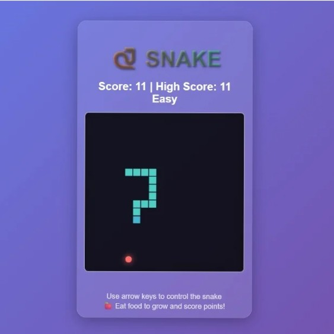

# 🐍 Juego de la Serpiente

Un clásico **Juego de la Serpiente** construido con **HTML**, **CSS** y **JavaScript** — sin librerías, sin frameworks, ¡solo diversión pura de front-end!



---

## 🎮 Cómo Jugar

-   Usa las **Teclas de Flecha** para mover la serpiente:
    -   ⬆️ Arriba
    -   ⬇️ Abajo
    -   ⬅️ Izquierda
    -   ➡️ Derecha
-   Come el círculo rojo (comida/manzana) para crecer.
-   Evita chocar con las paredes o tu propia cola.
-   El juego termina cuando la serpiente colisiona con una pared o consigo misma.
-   **Nuevo:** Mantén presionada una flecha para acelerar la serpiente.

---

## 🛠️ Características

-   **JavaScript puro** (sin librerías externas)
-   **Interfaz limpia** usando CSS moderno con glassmorphism
-   **Responsive design** - funciona en móviles y escritorio
-   **Controles táctiles** para dispositivos móviles
-   **4 niveles de dificultad**: Fácil, Medio, Difícil, Insano
-   **Sistema de aceleración** - mantén presionada una tecla para ir más rápido
-   **Efectos de sonido** generados dinámicamente
-   **Animaciones suaves** con interpolación entre movimientos
-   **Puntuación máxima persistente** guardada en memoria del navegador
-   **Diseño visual atractivo** con gradientes, sombras y efectos de brillo
-   **Serpiente animada** con cabeza detallada, ojos y lengua
-   **Comida pulsante** con efectos de resplandor dinámicos

---

## 🎨 Detalles Técnicos

-   **Canvas HTML5** para renderizado del juego
-   **Animaciones fluidas** usando `requestAnimationFrame`
-   **Sistema de interpolación** para movimientos suaves entre celdas
-   **Audio Web API** para efectos de sonido sin archivos externos
-   **CSS moderno** con variables, gradientes y backdrop-filter
-   **Controles adaptativos** para teclado y pantalla táctil
-   **Gestión de estado** completamente en memoria (sin localStorage)

---

## 📂 Estructura de Archivos

```
.
├── index.html         # Archivo HTML principal
├── index.css          # Estilos CSS del juego
├── index.js           # Lógica del juego en JavaScript
├── preview.png        # Imagen de vista previa/captura
├── favcion.png        # Imagen del favicon
└── README.md          # Documentación del proyecto
```

---

## 🚀 Ejecutar el Juego

Simplemente abre `index.html` en cualquier navegador moderno. ¡No se requiere configuración!

---

## 🎯 Controles

### Escritorio:
- **Teclas de flecha**: Direccionamiento
- **Mantener presionada**: Acelera la serpiente

### Móvil:
- **Botones direccionales**: Control táctil
- **Deslizar**: Gestos para cambiar dirección
- **Mantener presionado**: Acelera la serpiente

---

## 🏆 Sistema de Puntuación

- **+1 punto** por cada comida consumida
- **Puntuación máxima** se guarda automáticamente
- **Crecimiento progresivo** de la serpiente
- **Dificultad escalable** según la velocidad seleccionada